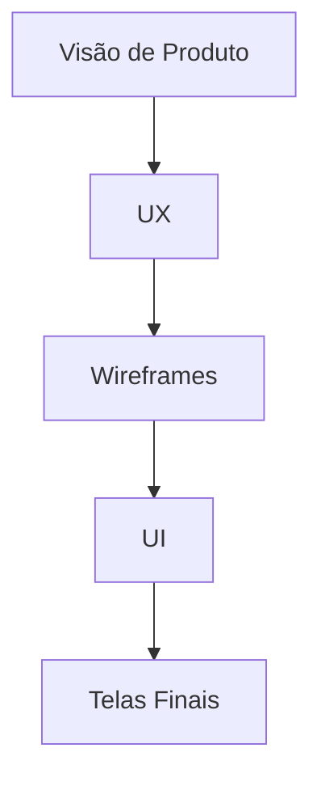

[↩️ Voltar](HOME)
```table-of-contents
```
---
# Design

> Hub central de tudo relacionado ao design do sistema  
> UI, UX, identidade visual e decisões de experiência

## Visão Geral do Design

- [[Design/Visão de Produto]]
- [[Design/Princípios de UX]]
- [[Design/Personas]]
- [[Design/Jornada do Usuário]]
## Arquitetura da Informação

- [[Design/Sitemap]]
- [[Design/Fluxos de Navegação]]
- [[Design/Estrutura de Telas]]

> Pode integrar com Mermaid aqui futuramente
## Wireframes

- [[Design/Wireframes/Home]]
- [[Design/Wireframes/Dashboard]]
- [[Design/Wireframes/Login]]

> 🔗 Links para arquivos do Excalidraw
## UI (Interface Visual)

- [[Design/UI/Design System]]
- [[Design/UI/Cores]]
- [[Design/UI/Tipografia]]
- [[Design/UI/Componentes]]
- [[Design/UI/Iconografia]]
## Experiência do Usuário (UX)

- [[Design/UX/Heurísticas]]
- [[Design/UX/Testes de Usabilidade]]
- [[Design/UX/Problemas Identificados]]
- [[Design/UX/Melhorias]]
## Telas Finais (High Fidelity)

- [[Design/Telas/Home]]
- [[Design/Telas/Dashboard]]
- [[Design/Telas/Perfil]]
## Versionamento de Design

- [[Design/Changelog de Design]]
- [[Design/Decisões de Design (DDRs)]]
## Integrações com Outras Áreas

- [[MOC - Produto]]
- [[MOC - Desenvolvimento]]
- [[MOC - Documentação]]
## Backlog de Design

- [[Design/Ideias]]
- [[Design/Melhorias Futuras]]
- [[Design/Dívidas de UX]]
## Mapa Visual (Opcional)




