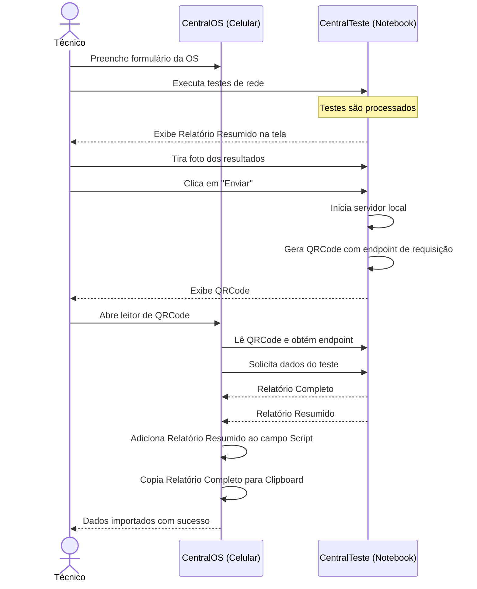

[↩️ Voltar](HOME)
```table-of-contents
```
---


```mermaid
sequenceDiagram
    actor Tecnico as Técnico
    participant COS as CentralOS (Celular)
    participant CT as CentralTeste (Notebook)

    Tecnico->>COS: Preenche formulário da OS
    Tecnico->>CT: Executa testes de rede

    Note over CT: Testes são processados

    CT-->>Tecnico: Exibe Relatório Resumido na tela
    Tecnico->>CT: Tira foto dos resultados

    Tecnico->>CT: Clica em "Enviar"

    CT->>CT: Inicia servidor local
    CT->>CT: Gera QRCode com endpoint de requisição

    CT-->>Tecnico: Exibe QRCode

    Tecnico->>COS: Abre leitor de QRCode
    COS->>CT: Lê QRCode e obtém endpoint

    COS->>CT: Solicita dados do teste

    CT-->>COS: Relatório Completo
    CT-->>COS: Relatório Resumido

    COS->>COS: Adiciona Relatório Resumido ao campo Script
    COS->>COS: Copia Relatório Completo para Clipboard

    COS-->>Tecnico: Dados importados com sucesso
```