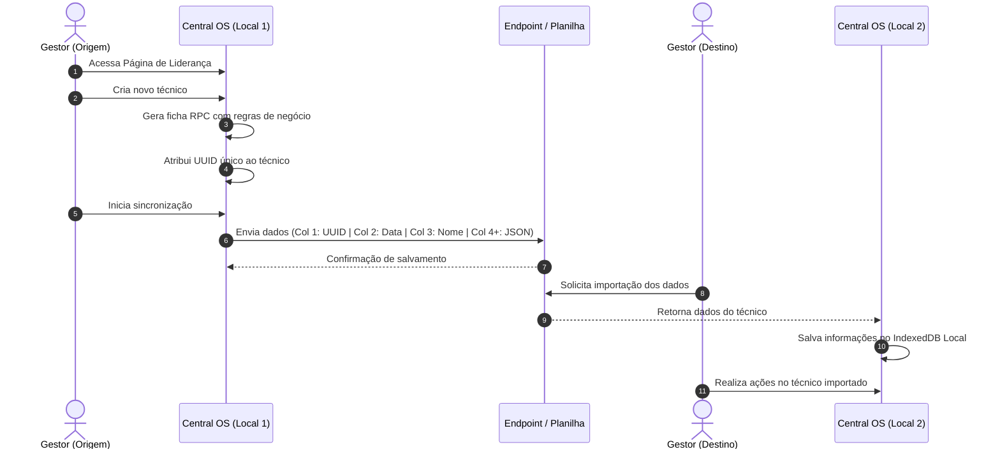

[↩️ Voltar](HOME)
```table-of-contents
```
---
A página da liderança será habilitada a partir de senha apenas para os líderes do setor. Sua função é organizar o modelo de Auditoria Externa, bem como a gestão da ficha RPC digital dos técnicos. O objetivo desse documento é orquestrar todo o planejamento dessa sessão, bem como definir todas as regras de negócio. 

Todo o controle de gestão será feito em um banco de dados local, e que será sincronizado com uma planilha do Google para a fácil gestão entre os líderes de um mesmo setor. O fluxo vai funcionar da seguinte forma: 

NO Central OS na página de liderança, o gestor irá criar um novo técnico. A geração irá criar uma nova ficha RPC com todas as regras de negocio desse sistema. Cada técnico irá possuir um UUID próprio. O gestor então irá sincronizar com uma link endpoint de planilha já pré configurada, que irá salvar o uuid na primeira coluna, data de sincronismo na segunda, nome do técnico na terceira, e os demais dados serão adicionados no formato JSON nas demais colunas. Assim, quando outro gestor precisar realizar ações naquele técnico, ele pode importar essas informaçoes salvas na planilha e salvar no indexedb local do Central OS. 



A gestão da ficha RPC foi uma escolha devido a facilidade de consulta e edição, auxiliando em momentos de observação recente e evitando que o gestor venha a esquecer de realizar um registro no futuro. Futuramente a ideia é integrar essa gestão também ao Etecc Frotas, migrando da planilha para a Ferramenta. Assim teremos acesso aos dados e plotagem rapidamente pelo Central OS, e também pelo Frotas. 

[[Regras de Negocio - Sistema de Registro de Performance em Campo (RPC)]]
## Planejamento da Página de Liderança

A página tem como objetivo agrupar todas as ferramentas usadas pela liderança do setor de Suporte Externo. Então teremos o controle da gestão dos técnico, bem como ferramentas de Script para os processos externos que temos que realizar. 
### Scripts

Estarei adicionando a ela o Script da Liderança usando todas as regras de negocio associadas a esse projeto. Atualmente os scripts são:

- **Abertura e Fechamento de Auditoria Externa** - Usada para auditorias externas pós atendimento técnico. Embora essa auditoria não seja feita diretamente na página técnica (*que iremos falar em seguida*), sua pontuação será associada a sua ficha RPC;


