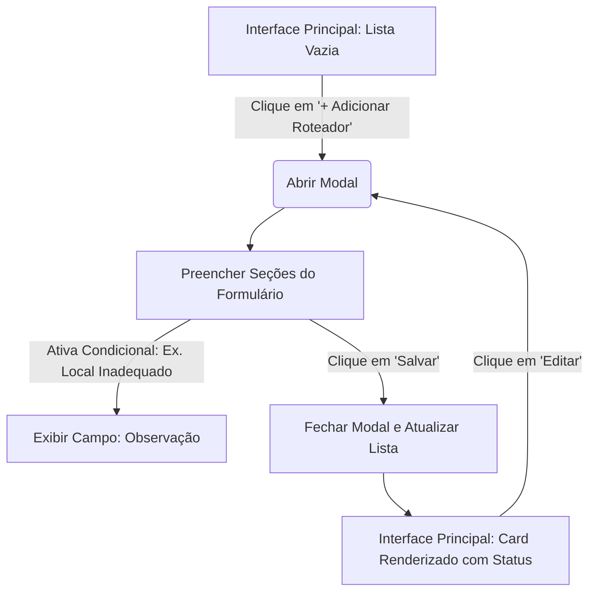

[↩️ Voltar](HOME)
```table-of-contents
```
---
Entendido. Vamos estruturar a experiência desse fluxo de auditoria/conferência de roteadores. O objeto de dados possui muitas propriedades booleanas (verdadeiro/falso) e condicionais (ex: se "outro_dns", habilitar string; se "ativos_anormal", pedir observação).

Aqui está o planejamento detalhado de UI/UX para a listagem e para o Modal de inserção/edição.
### 1. Diagnóstico

* **Complexidade de Carga Cognitiva:** O objeto possui 13+ campos, muitos deles aninhados (com status + observação). Colocar tudo isso de forma bruta em uma tabela ou em um modal bagunçado vai sobrecarregar o técnico ou operador que está preenchendo.
* **Problema de Escaneabilidade na Lista:** Se a interface principal listar todos esses dados de uma vez para múltiplos roteadores, a tela ficará poluída. O usuário precisa bater o olho e identificar *qual* roteador está configurado incorretamente ou precisa de atenção (ex: firmware desatualizado, local inadequado).
* **Campos Condicionais Escondidos:** Propriedades como `outro_dns` ou `observacao` dependem do valor de outra chave. Se não houver uma lógica clara de exibição progressiva, o usuário tentará preencher dados desnecessários.
### 2. Melhor Solução Recomendada

#### Na Interface Principal: Visualização em Cards Expandíveis ou Grid Técnico

Como a quantidade de roteadores por cliente costuma ser baixa (geralmente de 1 a 5 pontos), a melhor abordagem é uma **Lista de Cards Expandíveis (Accordions)** ou uma **Data Grid enxuta**. Vamos focar em **Cards de Status**, pois permitem destacar rapidamente o que está errado (Alertas de infraestrutura) sem precisar abrir o modal apenas para leitura.
#### No Modal: Formulário Dividido por Seções Lógicas com Divulgação Progressiva

O modal deve agrupar as informações por contexto (Identificação, Configurações de Rede, Diagnóstico/Alertas) para reduzir a carga cognitiva.

* **Justificativa:** * *Hierarquia Visual & Descoberta:* Identificar imediatamente se o roteador é o "Primeiro Ponto" ou "Ativo do Cliente".
* *Carga Cognitiva:* Agrupar inputs reduz a sensação de formulário infinito.
* *Feedback Visual:* Mostrar badges de erro/alerta (ex: se o firmware estiver desatualizado ou local inadequado).
### 3. Alternativas para a Interface Principal

#### Alternativa A: Data Grid (Tabela Compacta) com Linhas Expandíveis

* **Vantagens:** Excelente se o cliente tiver muitos roteadores (ex: mais de 10 roteadores em uma grande empresa).
* **Desvantagens:** Em telas mobile, vira um caos de rolagem horizontal.
* **Quando utilizar:** Sistemas puramente desktop focados em auditoria massiva de dados.
#### Alternativa B: Kanban de Status (Adequado vs. Atenção)

* **Vantagens:** Separa visualmente o que precisa de suporte imediato.
* **Desvantagens:** Complexidade desnecessária se o fluxo for apenas um checklist linear de instalação.
* **Quando utilizar:** Se houver um processo de triagem onde outra equipe precisa agir sobre os roteadores condenados.
### 4. Sugestão de Componentes

* **Cards + Accordion (Lista Principal):** Exibe o resumo do roteador (Nome/Ponto e Status Geral). Ao clicar, expande para ver os detalhes de DNS, IPV6, etc., sem abrir o modal.
* **Modal / Dialog (Edição/Criação):** Janela centralizada com scroll interno focado na tarefa de edição.
* **Segmented Buttons (Toggle Switches / Radio Groups):** Essencial para os campos `empresa` (Sim/Não), `largura_banda` (20/40/Ambos) e `router` (1º Ponto / 2º Ponto / Ativo).
* **Badges de Status:** Elementos visuais coloridos (verde/vermelho) para indicar rapidamente o estado do firmware ou local.
### 5. Sugestão Visual e Fluxo

#### Fluxo de Interação (Mermaid)



#### Layout do Modal (Campos Estruturados)

O formulário dentro do modal deve ser dividido em 3 seções:

**Seção 1: Identificação e Equipamento**

* **Tipo de Ponto (router):** Select ou Segmented Button `[1º Ponto] [2º Ponto] [Ativo Cliente]`
* **Propriedade (empresa):** Switch/Toggle `[ Equipamento da Empresa ] (Ativo/Inativo)`
* **Local do Equipamento (local_equipamento):** * Switch: `Adequado / Inadequado`
* *(Condicional: Se Inadequado)* $\rightarrow$ Switch: `Cliente Ciente?` + Textarea: `Motivo/Observação`

**Seção 2: Configurações de Rede**

* **DNS:** Select `[Etecc, Google, Outros]`
* *(Condicional: Se Outros)* $\rightarrow$ Input Text: `Especificar DNS`

* **Largura de Banda:** Radio Group `( ) 20MHz  ( ) 40MHz  ( ) 20/40MHz`
* **Protocolos:** Dois Toggles lado a lado: `[ UPnP Ativo ]` e `[ IPv6 (SLAAC) Ativo ]`
* **Acesso Remoto:** Toggle `[ Acesso Remoto Configurado ]`

**Seção 3: Diagnóstico de Anomalias**

* **Ativos Acima do Normal:** Switch `[ Sim / Não ]`
* *(Condicional: Se Sim)* $\rightarrow$ Input/Textarea: `Quantos / Observação`

* **Tempo de Atividade Elevado (>1 semana):** Switch `[ Sim / Não ]`
* *(Condicional: Se Sim)* $\rightarrow$ Textarea: `Observações da Atividade`

* **Firmware:** Switch `[ Firmware Atualizado ]`
### 6. Paleta e Identidade Visual (Foco em Redes/Infraestrutura)

Para um sistema técnico de redes, o ideal é usar uma paleta neutra com sinalizações semânticas fortes:

* **Cor Primária:** Azul Técnico (`#1E40AF`) - transmite confiança e sobriedade.
* **Sucesso (Adequado / Atualizado):** Verde (`#15803D`) - texto/ícone discreto.
* **Alerta/Erro (Inadequado / Anormal):** Âmbar/Laranja (`#B45309`) ou Vermelho (`#B91C1C`) para itens que exigem ação do técnico.
* **Contraste:** Garanta que os textos sobre os badges coloridos passem no teste de acessibilidade WCAG (relação mínima de contraste 4.5:1).
### 7. Boas Práticas

* **Inputs Condicionais Dinâmicos:** Nunca deixe o campo `outro_dns` ou as `observacoes` visíveis se o gatilho anterior for falso. Esconda-os para não poluir o formulário.
* **Valores Padrão Inteligentes:** Deixe os valores mais comuns já pré-selecionados (ex: `empresa: true`, `upnp: false`, `ipv6: false`, baseando-se no cenário real mais frequente).
* **Acessibilidade em Modais:** Certifique-se de que o foco do teclado vá para dentro do modal assim que ele abrir, e que a tecla `ESC` feche a janela.
### 8. Erros Comuns a Evitar

* **Excesso de Modais Aninhados:** Nunca abra um modal em cima de outro modal (ex: abrir um modal para cadastrar o "Outro DNS"). Resolva tudo na mesma linha de visualização.
* **Listar strings longas em tabelas apertadas:** Tentar mostrar o campo de texto `observacao` inteiro na listagem principal sem quebrar a linha ou truncar o texto destrói o layout. Prefira resumos na listagem principal.

Qual das abordagens para a listagem principal (Cards Expandíveis ou Tabela Compacta) se encaixa melhor no perfil dos usuários do seu sistema?


